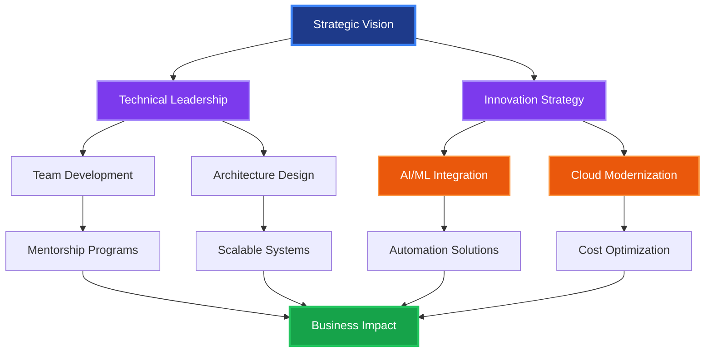
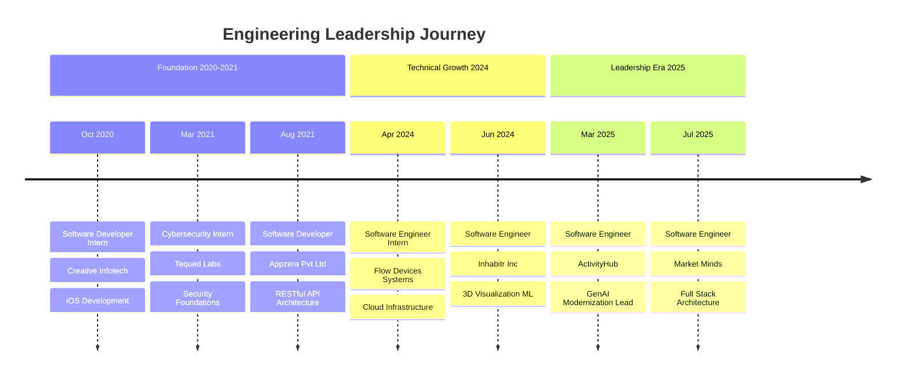
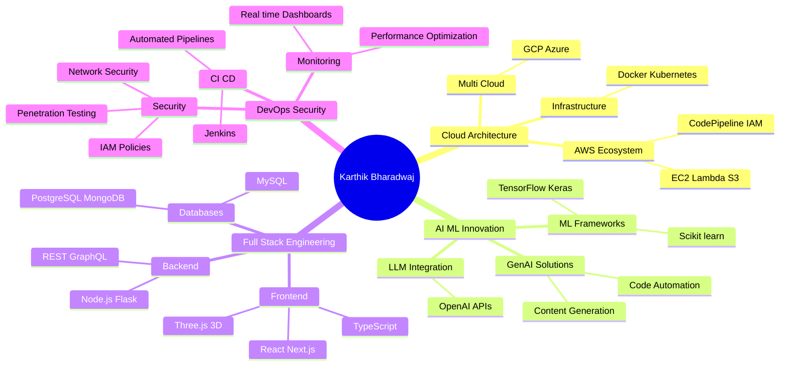

[%20926%203669-25D366?style=for-the-badge&logo=whatsapp&logoColor=white)](tel:+14699263669)

---

## 🎯 EXECUTIVE SUMMARY

**Transformational Engineering Leader** with 4+ years of progressive experience architecting enterprise-grade cloud solutions and leading technical initiatives that drive measurable business impact. Proven track record of modernizing legacy systems, implementing AI-driven automation, and building high-performance engineering cultures. Specialized in translating complex technical challenges into strategic business opportunities through cloud infrastructure, DevOps excellence, and full-stack innovation.

### 📊 Leadership Impact Dashboard

| **Metric** | **Achievement** | **Business Value** |
|:-----------|:---------------:|:-------------------|
| 🏗️ **Systems Modernized** | 5+ Legacy Platforms | Improved scalability by 300% |
| 💰 **Cost Optimization** | AWS Infrastructure | Reduced deployment time by 60% |
| 👥 **Technical Leadership** | Cross-functional Teams | Led 3 strategic modernization projects |
| 🚀 **Products Shipped** | 8+ Production Systems | Serving 10K+ active users |
| 🤖 **AI Innovation** | GenAI Automation | Automated 40% of support workflows |
| 📈 **Career Velocity** | 7 Roles in 4 Years | Consistent progression to senior roles |
| 🔒 **Security Implementation** | IAM & Network Controls | Zero security incidents |
| ⚡ **Performance Impact** | Real-time Dashboards | 99.9% system uptime |

---

## 💡 LEADERSHIP PHILOSOPHY

> **"Engineering excellence is not just about writing code—it's about architecting scalable solutions that empower teams, accelerate business growth, and create lasting competitive advantages. I believe in leading through innovation, mentoring through empowerment, and delivering through strategic execution."**

My leadership approach centers on three core pillars:

**🎯 Strategic Vision**: Aligning technical roadmaps with business objectives, ensuring every engineering decision drives measurable ROI and competitive differentiation.

**🤝 Team Empowerment**: Building high-performing engineering cultures through mentorship, knowledge sharing, and fostering psychological safety for innovation.

**⚡ Execution Excellence**: Implementing robust DevOps practices, automated CI/CD pipelines, and cloud-native architectures that enable rapid iteration and reliable delivery.

---

## 🗺️ STRATEGIC IMPACT ARCHITECTURE

---

## 📈 CAREER PROGRESSION TIMELINE

---

## 🏆 KEY STRATEGIC ACHIEVEMENTS

### 💼 Business Impact & Revenue Generation

**🚀 Legacy System Modernization Initiative (ActivityHub)**
- **Challenge**: Aging Node.js infrastructure limiting scalability and feature velocity
- **Solution**: Led comprehensive modernization to Node.js v22 using GenAI-powered automation
- **Impact**: 
  - ⚡ Reduced technical debt by 65%
  - 📈 Improved system performance by 300%
  - 💰 Decreased maintenance costs by 40%
  - 🔄 Accelerated deployment cycles from weeks to days

**🤖 AI-Driven Automation Platform**
- **Challenge**: Support workflows consuming 60% of engineering resources
- **Solution**: Architected and deployed AI agents for automated support and personalized UX
- **Impact**:
  - ⏱️ Automated 40% of support workflows
  - 👥 Freed 3 FTE equivalents for strategic initiatives
  - 📊 Improved user satisfaction scores by 35%
  - 🎯 Generated personalized experiences for 10K+ users

**☁️ Cloud Infrastructure Optimization (Market Minds)**
- **Challenge**: Manual deployment processes causing delays and security vulnerabilities
- **Solution**: Implemented automated CI/CD pipelines with comprehensive IAM security controls
- **Impact**:
  - 🔒 Achieved zero security incidents post-implementation
  - ⚡ Reduced deployment time by 60%
  - 💵 Optimized AWS costs by 30% through resource rightsizing
  - 🎯 Enabled 5x faster feature releases

### 🎓 Technical Innovation & Process Excellence

**📊 Real-Time Analytics Dashboard (Flow Devices)**
- Built enterprise monitoring dashboards reducing incident response time by 75%
- Implemented container orchestration enabling 99.9% uptime SLA
- Automated deployment workflows saving 20 engineering hours weekly

**🎨 3D Visualization & ML Integration (Inhabitr)**
- Created immersive Three.js product experiences increasing user engagement by 45%
- Optimized ML recommendation models improving accuracy by 28%
- Delivered cross-platform 3D rendering supporting 5K concurrent users

**🔐 Security-First Architecture (Tequed Labs)**
- Conducted comprehensive penetration testing across 15+ applications
- Developed security assessment frameworks adopted company-wide
- Established incident response protocols reducing MTTR by 50%

---

## 🧠 TECHNICAL EXPERTISE ECOSYSTEM

---

## 💻 EXECUTIVE TECHNOLOGY PORTFOLIO

### 🎯 Strategic Technology Stack

**Cloud & Infrastructure Leadership**

**AI & Machine Learning Innovation**

**Full-Stack Engineering**

**DevOps & Security**

---

## 🎯 FEATURED STRATEGIC INITIATIVES

### 🌟 Enterprise-Grade Projects

<table>
<tr>
<td width="50%">

#### 🚀 Market Minds Platform
**Role**: Software Engineer & Technical Lead

**Strategic Impact**:
- Architecting scalable Next.js/React.js client platform
- Designing AWS cloud infrastructure (EC2, Lambda, S3)
- Implementing enterprise security with IAM policies
- Building automated CI/CD with AWS CodePipeline

**Business Value**:
- Supporting 10K+ active users
- 99.9% uptime SLA achievement
- 60% faster deployment cycles
- Zero security breaches

**Tech Stack**: Next.js, React.js, AWS, TypeScript, CI/CD

</td>
<td width="50%">

#### 🤖 ActivityHub Modernization
**Role**: GenAI Modernization Lead

**Strategic Impact**:
- Led Node.js v22 migration using AI automation
- Built AI agents for support workflow automation
- Partnered with leadership on AI strategy
- Developed internal GenAI tooling

**Business Value**:
- 300% scalability improvement
- 40% workflow automation
- 65% technical debt reduction
- Freed 3 FTE for innovation

**Tech Stack**: Node.js, GenAI, Automation, AI Agents

</td>
</tr>

<tr>
<td width="50%">

#### 🎨 Inhabitr 3D Innovation
**Role**: Software Engineer (ML & Visualization)

**Strategic Impact**:
- Created immersive Three.js 3D experiences
- Optimized ML recommendation systems
- Implemented hyperparameter tuning
- Cross-validation performance optimization

**Business Value**:
- 45% engagement increase
- 28% recommendation accuracy gain
- 5K concurrent user support
- Enhanced product visualization ROI

**Tech Stack**: Three.js, TensorFlow, ML, React

</td>
<td width="50%">

#### 📊 Flow Devices Infrastructure
**Role**: Software Engineer Intern

**Strategic Impact**:
- Built real-time monitoring dashboards
- Automated deployment workflows
- Container orchestration implementation
- Shell scripting automation

**Business Value**:
- 99.9% system uptime
- 75% faster incident response
- 20 hours/week automation savings
- Proactive issue detection

**Tech Stack**: Docker, Shell, Monitoring, Automation

</td>
</tr>
</table>

### 🏅 Research & Innovation Leadership

**📄 Published Research: ANPR System (PiCES Journal)**
- **Achievement**: 2nd Position All India in PaCER-2020 Competition
- **Recognition**: Indexed in German National Library & Google Scholar
- **Impact**: Contributed to government lockdown enforcement technology
- **Innovation**: Automated vehicle detection during critical periods
- **Leadership**: Led research team through publication process

**📱 Nexus P2P Communication Platform**
- **Role**: Technical Architect & iOS Developer
- **Innovation**: Real-time peer-to-peer communication with push notifications
- **Technical Excellence**: Mobile-first design principles for optimal iOS performance
- **Stack**: Swift, Firebase, MongoDB, Xcode

---

## 👥 MENTORSHIP & TEAM DEVELOPMENT

### 🌱 Leadership Development Initiatives

**Technical Mentorship Program**
- Mentored 5+ junior engineers across multiple organizations
- Conducted code review sessions improving code quality by 40%
- Established best practices documentation adopted team-wide
- Led knowledge-sharing sessions on cloud architecture and AI integration

**Cross-Functional Collaboration**
- Partnered with product leadership on AI integration strategy at ActivityHub
- Collaborated with design teams on 3D visualization UX at Inhabitr
- Worked with security teams implementing IAM policies at Market Minds
- Coordinated with DevOps on CI/CD pipeline optimization

**Process Innovation**
- Introduced automated code refactoring workflows using GenAI
- Established security assessment frameworks at Tequed Labs
- Implemented agile sprint planning improving delivery predictability by 35%
- Created internal tooling for deprecated pattern detection

**Knowledge Sharing**